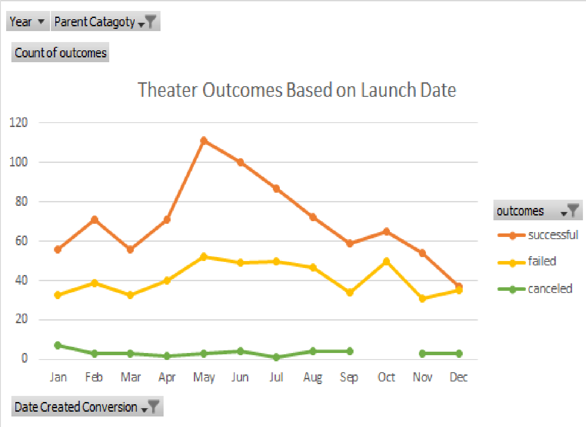

# Kickstarter_Challange- Juhi Aggarwal

## Overview of Project

### Purpose
The purpose of this project is to identify what factors contribute to curtain outcomes of those in the kickstarter data set. 

## Analysis and Challenges

### Analysis of Outcomes Based on Launch Date

### Analysis of Outcomes Based on Goals

### Challenges and Difficulties Encountered
A major difficulty encountered was correctly using the "countifs" statement. Initally when doing this I did not lock down the "F:F" statement in "Kickstarter!"$"F:"$" F" statements (for all needed factors). Therefor when dragging the row over it would lead to an error as "Kickstarter!G:G" did not contain "failed" or "canceled". To fix this I first made sure that all factors where spelt correctly and then checked that my formulas were correct. After doing so I realized that the different coloumns meant that the values were not able to be counted properly. After the $ signs were added to lock in the "F:F" values the "countifs" worked correctly.

## Results

- What are two conclusions you can draw about the Outcomes based on Launch Date?

A major conclusion that we can draw from this analysis is that May had the highst number of successful kickstarter while December had the lowest. Another major conclusion is that there were no cancelled kickstarter in October. 

- What can you conclude about the Outcomes based on Goals?

A major conclusion that one can see in this analysis is that there were no successful kickstarters at the $45,000 to $49,999 range and that kickstarters with a less than $1,000 goal had the highest rate of success. 

- What are some limitations of this dataset?

Some limitation of the dataset is....
- What are some other possible tables and/or graphs that we could create?

Another table that we can make is Outcomes based on......
