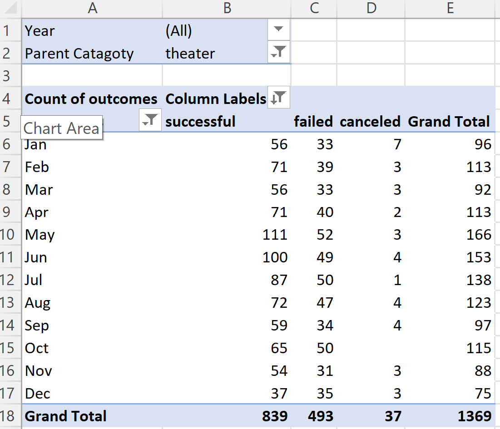
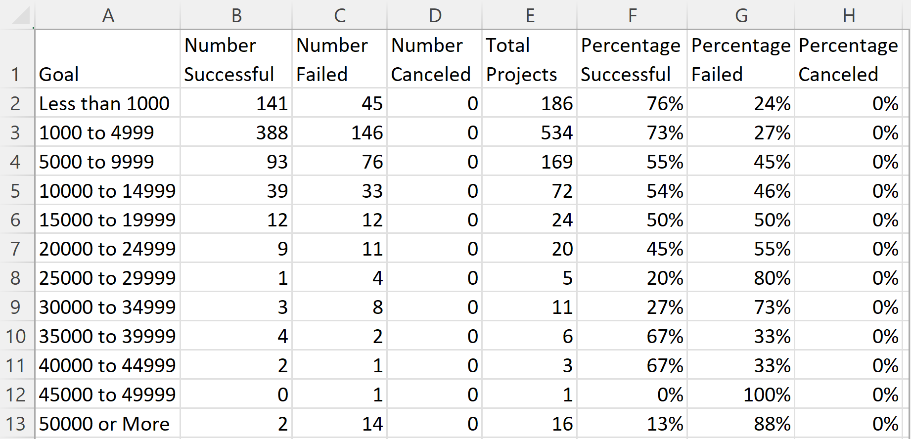
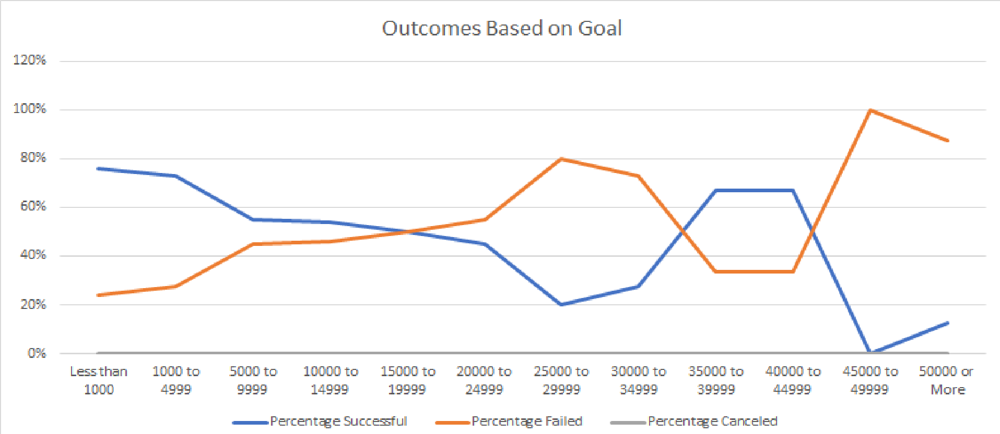

# Kickstarter_Challange- Juhi Aggarwal

## Overview of Project

### Purpose
The purpose of this project is to identify what factors contribute to curtain outcomes of those in the kickstarter data set. 

## Analysis and Challenges

### Analysis of Outcomes Based on Launch Date
From the class work I created a "Years" coloumn from the "Date Created Conversion" coloumn. The "Date Created Conversion" Colomn was made by convering the Unix timestamps to a readable format. From then a new pivot table was made and named "Theater Outcomes by Launch Date". The fillters were "parent catagory" and "years". The coloumns were Outcomes and filtered as "successful", "failed", and "cancelled" (and then sorted to be in declining order).The rows were "date created conversion", and the values were count of outcomes. The table was filtered by parent catagory theater. 

Finally a line graph was made to visualize what months had the highest and lowest rates of outcomes. 

### Analysis of Outcomes Based on Goals
In the Kickstarter file we createda new sheet and make sure it had the following columns: Goals, number successful, number failed, number canceled, total projects, percentage successful, percentage failed, and percentage canceled. The goal column was then added and the ranges were set up as less than 1000 and then upped in $5000 increments. The countifs function was then used. Cell B2 had the following input: "=COUNTIFS(Kickstarter!$F:$F,"successful",Kickstarter!$D:$D,"<1000",Kickstarter!$S:$S, "plays")" as we go down the rows "Kickstarter!$D:$D,"XX"" changes to match the goals coloumn (example for C2: "=COUNTIFS(Kickstarter!$F:$F,"successful",Kickstarter!$D:$D,">=1000", Kickstarter!$D:$D, "<5000", Kickstarter!$S:$S, "plays")"). As we go across the coloumns we take coloumn B and change "Kickstarter!$F:$F,"successful"" to "Kickstarter!$F:$F,"failed"" for coloumn C and "Kickstarter!$F:$F,"canceled""  for coloumn D. 
Coloumn E is calculated as the sum of coloumns B:D. Coloumn F is calculated as Bx/Ex (where x is the row number) and then  the coloumn is reformated to be a percentage format. The same is done for coloumn G (Cx/Ex) and coloumn H (Dx/Ex). 

Finally a line graph was made to highlight the percentage failed, successed, and canceled. 

### Challenges and Difficulties Encountered
A major difficulty encountered was correctly using the "countifs" statement. Initally when doing this I did not lock down the "F:F" statement in "Kickstarter!"$"F:"$" F" statements (for all needed factors). Therefor when dragging the row over it would lead to an error as "Kickstarter!G:G" did not contain "failed" or "canceled". To fix this I first made sure that all factors where spelt correctly and then checked that my formulas were correct. After doing so I realized that the different coloumns meant that the values were not able to be counted properly. After the "$" signs were added to lock in the "F:F" values the "countifs" worked correctly.

## Results

- What are two conclusions you can draw about the Outcomes based on Launch Date?

A major conclusion that we can draw from this analysis is that May had the highst number of successful kickstarter while December had the lowest. Another major conclusion is that there were no cancelled kickstarter in October. 

- What can you conclude about the Outcomes based on Goals?

A major conclusion that one can see in this analysis is that there were no successful kickstarters at the $45,000 to $49,999 range and that kickstarters with a less than $1,000 goal had the highest rate of success. 

- What are some limitations of this dataset?

Some limitation of the dataset is....
- What are some other possible tables and/or graphs that we could create?

Another table that we can make is Outcomes based on......
